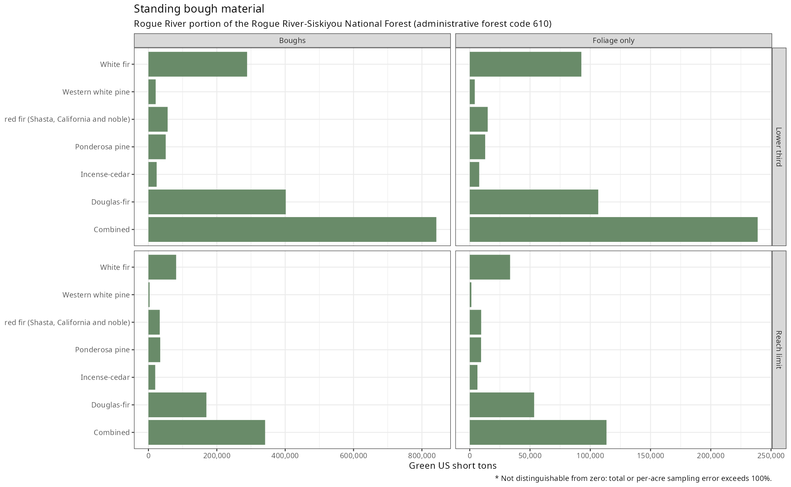
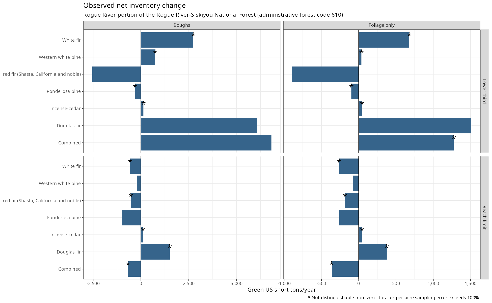
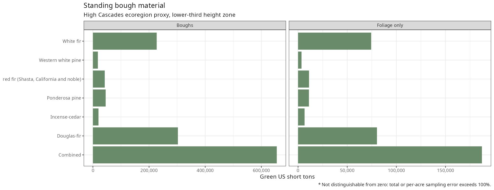
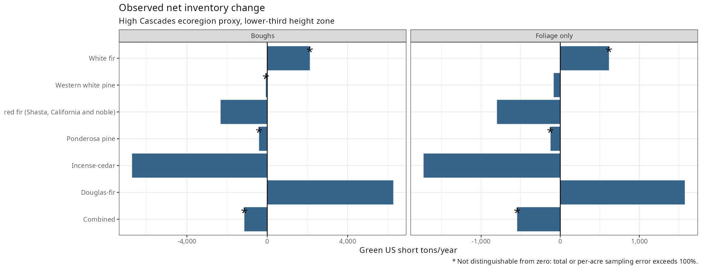

# Bough Resource Inventory

Standing weight and annual change of harvestable conifer boughs on a National Forest, from public Forest Inventory and Analysis data, in plain R.

This analysis estimates standing bough material and annual inventory change on nonreserved forest land in the Oregon part of the Rogue River portion of the Rogue River-Siskiyou National Forest, administrative forest code 610. It uses a January 2022 public inventory copy whose most recent evaluation reports through 2019, and it includes an approximate High Cascades district proxy. The primary quantity is foliage plus branch wood cut to the bole, consistent with the whole-branch harvest described by the permit terms. Foliage alone is a secondary quantity for a tip-cutting interpretation. These estimates describe the material within the modeled harvest zone and its change between measurements, without establishing saleable yield, recovery after cutting, or an annual cutting allowance.

## Run the analysis

Run each command from the repository root with R and the packages dplyr, tidyr, ggplot2, scales, knitr, rFIA, and merchandiser installed. The [software versions](output/software_versions.csv) record the environment used for these results. Place a coherent public Oregon inventory release in `data/FIA`, or set `fia_dir` in scripts 01 through 06 to the same local data directory. Raw tables and tree records remain excluded from publication.

| Command | Purpose |
| --- | --- |
| `Rscript scripts/01_stage_data.R` | Read the public inventory and record its file vintage. |
| `Rscript scripts/02_plot_counts.R` | Count forest plots and live trees from the plot-level forest assignment. |
| `Rscript scripts/03_bough_models.R` | Select forest conditions and estimate crown mass at both visits. |
| `Rscript scripts/04_estimates.R` | Estimate standing material and the sensitivity to crown allocation. |
| `Rscript scripts/05_regrowth.R` | Estimate annual change and its components on remeasured plots. |
| `Rscript scripts/06_district_example.R` | Estimate standing material and change for the district proxy. |
| `Rscript scripts/07_tables.R` | Write the result tables and figures from the calculated outputs. |

The optional `scripts/00_download.R` contains the public download command. Set its destination to an empty local directory before enabling the download, then run scripts 01 through 07 on the replacement release. Changes to the forest or crown settings require another run of scripts 03 through 07. The district proxy has its own settings in script 06.

## Select the domain

1. **Forest codes.** Set `forest_codes <- c(610)` in script 03 for the Rogue River portion, or `c(610, 611)` to include the Siskiyou portion. Scripts 04 and 05 inherit this condition-level selection. Script 02 counts the plot-level assignment from `FVS_REGION` and `FVS_FOREST`, which is a different definition.
2. **District code.** Set `district` in script 03 to a verified `PLOTGEOM.FVS_DISTRICT` value when the field is populated. The Forest Inventory and Analysis (FIA) program assigns this code from exact locations. This vintage has no district assignments.
3. **Ecoregion proxy.** Set `forest_codes` and `ecoregions` in script 06. Its High Cascades example uses code 610 with `M242Bb`, `M242Be`, `M242Bg`, and `M261Dh`. The Siskiyou Mountains proxy uses `M261Ae`, `M261Ao`, and `M261Av` within code 610. Ecoregion assignments use fuzzed and swapped public coordinates, so these are approximate district boundaries.

The district proxy uses the plot-level forest field `FVS_LOC_CD`, while the main estimates use the condition field `ADFORCD`. District totals therefore describe a separate selection and are not an exact subdivision of the main estimates.

## Assumptions and sources

The [source ledger](data/sources.csv) records published values, citations, and pages. Analysis assumptions describe choices made in scripts 03 through 06.

| Assumption | Application | Source |
| --- | --- | --- |
| Forest land | Forest conditions in code 610 with reserved status 0, excluding code 611 and all reserved land. | Ledger `adfor` and `reserved`, script 03. |
| Tree height | Live target trees taller than 15 feet. | Ledger `min_ht`, bough harvesting guidance. |
| Harvest zone | The lower third of total tree height, with an additional scenario limited to 15 feet above ground. | Ledger `zone_fraction`, reach assumption in script 03. |
| Crown shape | A cone with uniform biomass density and a continuous crown represented by the recorded compacted crown ratio. | Ledger `crown_ratio`, allocation assumption in script 03. |
| Removal cap | At most one third of foliage, with the same fraction applied to branch mass. | Ledger `removal_cap`, branch allocation assumption in script 03. |
| Material | Boughs include foliage and branch wood cut to the bole, and foliage alone is a secondary quantity. | Permit interpretation and mass calculations in script 03. |
| Density direction | Lower branches are assumed to carry more wood per unit foliage, making the cone conservative for total weight and mildly optimistic for foliage alone. | Qualitative crown distribution assumption, discussed in NOTES. |
| Crown equations | National Scale Volume and Biomass equations through merchandiser, using national coefficients and the recorded species code. | Ledger `nsvb`, script 03. |
| Fir reporting | Codes 20, 21, and 22 are combined as red fir (Shasta, California and noble) before population estimation. | Grouping in scripts 03 and 06, [crown component check](output/crown_component_check.csv). |
| Green weight | Dry weight multiplied by 2.42 for both components and all species, with published alternatives of 2.27 and 2.54. | Ledger `green_moderate`, `green_dry`, and `green_wet`, Blatner and colleagues (2005), pages 47 and 48. |
| Weight units | Green US short tons, with 2,000 pounds per ton and 0.45359237 kilograms per pound. | Exact unit definitions in the ledger and script 03. |
| Population estimates | The rFIA temporally indifferent estimator uses the most recent evaluation and a common nonreserved-area denominator within each sample. | Scripts 03 through 06 and installed rFIA documentation. |
| Survivor change | Each tree's mass is estimated at both visits and its difference is divided by the measurement interval. | Script 05 and the recorded previous-tree links. |
| Mortality and removals | Previous live mass is multiplied by the annual inventory factor, omitting unobserved growth before loss. | Scripts 05 and 06. |
| Missing links | Trees without required previous measurements are excluded from affected components. | Exclusion counts in [plot support](output/plot_counts.csv) and [district change](output/district_change.csv). |
| Sampling error | Errors reflect the inventory sample design and omit crown model, moisture, missing-link, and proxy-boundary uncertainty. | rFIA estimates in scripts 04 through 06. |

## Results

The headline tables use the lower-third height zone and cone allocation. Boughs include foliage and branch wood, while foliage only excludes branch wood. Standing totals are green US short tons and change totals are green US short tons per year. Per-acre estimates use the nonreserved forest area for the corresponding sample. Totals are rounded to whole tons, per-acre estimates to three decimals, and sampling errors to one decimal. The comma-separated files retain full precision and include the forest reach scenario and [linear allocation sensitivity](output/linear_sensitivity.csv).

A row marked **not distinguishable from zero** has an unrounded total or per-acre sampling error above 100 percent, and `NA` means that the relative error is undefined.

Gross accrual adds positive survivor changes, survivor loss is signed negative, and ingrowth adds material from entering trees. Mortality and removals are positive losses that are subtracted from the net balance. Net change is the sum of these observed components, with missing required links excluded. A smaller sampling error does not by itself establish a statistically significant change or a sustainable cutting rate.

<!-- results:start -->

### Forest standing material

|Species                                |Material     |Total  |Total error (%) |Per acre |Per-acre error (%) |Flag |
|:--------------------------------------|:------------|:------|:---------------|:--------|:------------------|:----|
|Douglas-fir                            |Boughs       |401679 |11.0            |0.799    |10.1               |     |
|Douglas-fir                            |Foliage only |106619 |11.1            |0.212    |10.2               |     |
|Incense-cedar                          |Boughs       |24052  |30.0            |0.048    |29.6               |     |
|Incense-cedar                          |Foliage only |7842   |30.2            |0.016    |29.8               |     |
|Ponderosa pine                         |Boughs       |50538  |30.2            |0.101    |29.9               |     |
|Ponderosa pine                         |Foliage only |12798  |29.9            |0.025    |29.6               |     |
|Western white pine                     |Boughs       |21138  |40.2            |0.042    |40.1               |     |
|Western white pine                     |Foliage only |4157   |34.7            |0.008    |34.5               |     |
|White fir                              |Boughs       |288614 |12.9            |0.574    |12.1               |     |
|White fir                              |Foliage only |92600  |12.3            |0.184    |11.4               |     |
|red fir (Shasta, California and noble) |Boughs       |56174  |28.2            |0.112    |27.7               |     |
|red fir (Shasta, California and noble) |Foliage only |14894  |28.7            |0.030    |28.3               |     |
|Combined                               |Boughs       |842196 |8.9             |1.675    |7.8                |     |
|Combined                               |Foliage only |238910 |9.0             |0.475    |7.9                |     |

### Forest annual change components

|Species                                |Material     |Component     |Total  |Total error (%) |Per acre |Per-acre error (%) |Flag                          |
|:--------------------------------------|:------------|:-------------|:------|:---------------|:--------|:------------------|:-----------------------------|
|Douglas-fir                            |Boughs       |Gross accrual |17610  |14.7            |0.035    |13.9               |                              |
|Douglas-fir                            |Boughs       |Ingrowth      |5817   |19.9            |0.012    |19.4               |                              |
|Douglas-fir                            |Boughs       |Mortality     |1202   |45.1            |0.002    |44.7               |                              |
|Douglas-fir                            |Boughs       |Net change    |6066   |63.9            |0.012    |63.8               |                              |
|Douglas-fir                            |Boughs       |Removals      |632    |56.8            |0.001    |56.6               |                              |
|Douglas-fir                            |Boughs       |Survivor loss |-15527 |15.4            |-0.031   |14.7               |                              |
|Douglas-fir                            |Foliage only |Gross accrual |3950   |14.4            |0.008    |13.7               |                              |
|Douglas-fir                            |Foliage only |Ingrowth      |1893   |19.9            |0.004    |19.4               |                              |
|Douglas-fir                            |Foliage only |Mortality     |376    |48.5            |0.001    |48.2               |                              |
|Douglas-fir                            |Foliage only |Net change    |1509   |63.1            |0.003    |63.0               |                              |
|Douglas-fir                            |Foliage only |Removals      |199    |56.1            |0.000    |55.9               |                              |
|Douglas-fir                            |Foliage only |Survivor loss |-3759  |15.1            |-0.008   |14.4               |                              |
|Incense-cedar                          |Boughs       |Gross accrual |819    |29.0            |0.002    |28.6               |                              |
|Incense-cedar                          |Boughs       |Ingrowth      |189    |48.5            |0.000    |48.2               |                              |
|Incense-cedar                          |Boughs       |Mortality     |68     |73.7            |0.000    |73.5               |                              |
|Incense-cedar                          |Boughs       |Net change    |128    |328.8*          |0.000    |328.8*             |not distinguishable from zero |
|Incense-cedar                          |Boughs       |Removals      |0      |NA              |0.000    |NA                 |                              |
|Incense-cedar                          |Boughs       |Survivor loss |-812   |38.9            |-0.002   |38.5               |                              |
|Incense-cedar                          |Foliage only |Gross accrual |272    |28.7            |0.001    |28.3               |                              |
|Incense-cedar                          |Foliage only |Ingrowth      |65     |48.1            |0.000    |47.9               |                              |
|Incense-cedar                          |Foliage only |Mortality     |22     |72.3            |0.000    |72.1               |                              |
|Incense-cedar                          |Foliage only |Net change    |43     |331.4*          |0.000    |331.4*             |not distinguishable from zero |
|Incense-cedar                          |Foliage only |Removals      |0      |NA              |0.000    |NA                 |                              |
|Incense-cedar                          |Foliage only |Survivor loss |-273   |39.6            |-0.001   |39.3               |                              |
|Ponderosa pine                         |Boughs       |Gross accrual |2168   |41.2            |0.004    |41.0               |                              |
|Ponderosa pine                         |Boughs       |Ingrowth      |441    |39.9            |0.001    |39.6               |                              |
|Ponderosa pine                         |Boughs       |Mortality     |0      |NA              |0.000    |NA                 |                              |
|Ponderosa pine                         |Boughs       |Net change    |-306   |414.1*          |-0.001   |414.1*             |not distinguishable from zero |
|Ponderosa pine                         |Boughs       |Removals      |0      |NA              |0.000    |NA                 |                              |
|Ponderosa pine                         |Boughs       |Survivor loss |-2915  |33.6            |-0.006   |33.3               |                              |
|Ponderosa pine                         |Foliage only |Gross accrual |471    |39.7            |0.001    |39.4               |                              |
|Ponderosa pine                         |Foliage only |Ingrowth      |126    |39.1            |0.000    |38.9               |                              |
|Ponderosa pine                         |Foliage only |Mortality     |0      |NA              |0.000    |NA                 |                              |
|Ponderosa pine                         |Foliage only |Net change    |-99    |285.1*          |-0.000   |285.0*             |not distinguishable from zero |
|Ponderosa pine                         |Foliage only |Removals      |0      |NA              |0.000    |NA                 |                              |
|Ponderosa pine                         |Foliage only |Survivor loss |-695   |33.4            |-0.001   |33.1               |                              |
|Western white pine                     |Boughs       |Gross accrual |1184   |62.3            |0.002    |62.1               |                              |
|Western white pine                     |Boughs       |Ingrowth      |216    |68.0            |0.000    |67.9               |                              |
|Western white pine                     |Boughs       |Mortality     |172    |85.0            |0.000    |84.9               |                              |
|Western white pine                     |Boughs       |Net change    |742    |100.5*          |0.001    |100.3*             |not distinguishable from zero |
|Western white pine                     |Boughs       |Removals      |0      |NA              |0.000    |NA                 |                              |
|Western white pine                     |Boughs       |Survivor loss |-485   |44.8            |-0.001   |44.5               |                              |
|Western white pine                     |Foliage only |Gross accrual |175    |55.3            |0.000    |55.0               |                              |
|Western white pine                     |Foliage only |Ingrowth      |96     |68.1            |0.000    |68.0               |                              |
|Western white pine                     |Foliage only |Mortality     |87     |88.5            |0.000    |88.5               |                              |
|Western white pine                     |Foliage only |Net change    |36     |307.2*          |0.000    |307.0*             |not distinguishable from zero |
|Western white pine                     |Foliage only |Removals      |0      |NA              |0.000    |NA                 |                              |
|Western white pine                     |Foliage only |Survivor loss |-148   |40.3            |-0.000   |40.0               |                              |
|White fir                              |Boughs       |Gross accrual |12739  |16.6            |0.026    |15.9               |                              |
|White fir                              |Boughs       |Ingrowth      |1269   |18.9            |0.003    |18.3               |                              |
|White fir                              |Boughs       |Mortality     |1665   |35.0            |0.003    |34.7               |                              |
|White fir                              |Boughs       |Net change    |2732   |107.9*          |0.005    |107.8*             |not distinguishable from zero |
|White fir                              |Boughs       |Removals      |13     |101.4*          |0.000    |101.3*             |not distinguishable from zero |
|White fir                              |Boughs       |Survivor loss |-9598  |22.2            |-0.019   |21.7               |                              |
|White fir                              |Foliage only |Gross accrual |3686   |16.0            |0.007    |15.3               |                              |
|White fir                              |Foliage only |Ingrowth      |587    |18.6            |0.001    |18.0               |                              |
|White fir                              |Foliage only |Mortality     |594    |31.1            |0.001    |30.7               |                              |
|White fir                              |Foliage only |Net change    |677    |126.8*          |0.001    |126.8*             |not distinguishable from zero |
|White fir                              |Foliage only |Removals      |7      |101.4*          |0.000    |101.3*             |not distinguishable from zero |
|White fir                              |Foliage only |Survivor loss |-2996  |21.1            |-0.006   |20.6               |                              |
|red fir (Shasta, California and noble) |Boughs       |Gross accrual |2220   |28.7            |0.004    |28.2               |                              |
|red fir (Shasta, California and noble) |Boughs       |Ingrowth      |556    |52.2            |0.001    |51.9               |                              |
|red fir (Shasta, California and noble) |Boughs       |Mortality     |46     |73.9            |0.000    |73.8               |                              |
|red fir (Shasta, California and noble) |Boughs       |Net change    |-2541  |81.4            |-0.005   |81.2               |                              |
|red fir (Shasta, California and noble) |Boughs       |Removals      |0      |NA              |0.000    |NA                 |                              |
|red fir (Shasta, California and noble) |Boughs       |Survivor loss |-5271  |41.9            |-0.011   |41.5               |                              |
|red fir (Shasta, California and noble) |Foliage only |Gross accrual |520    |29.2            |0.001    |28.7               |                              |
|red fir (Shasta, California and noble) |Foliage only |Ingrowth      |171    |51.0            |0.000    |50.6               |                              |
|red fir (Shasta, California and noble) |Foliage only |Mortality     |15     |74.4            |0.000    |74.3               |                              |
|red fir (Shasta, California and noble) |Foliage only |Net change    |-892   |81.4            |-0.002   |81.3               |                              |
|red fir (Shasta, California and noble) |Foliage only |Removals      |0      |NA              |0.000    |NA                 |                              |
|red fir (Shasta, California and noble) |Foliage only |Survivor loss |-1568  |47.6            |-0.003   |47.3               |                              |
|Combined                               |Boughs       |Gross accrual |36740  |11.4            |0.074    |10.4               |                              |
|Combined                               |Boughs       |Ingrowth      |8487   |15.9            |0.017    |15.2               |                              |
|Combined                               |Boughs       |Mortality     |3153   |26.7            |0.006    |26.2               |                              |
|Combined                               |Boughs       |Net change    |6821   |99.9            |0.014    |99.9               |                              |
|Combined                               |Boughs       |Removals      |646    |55.7            |0.001    |55.5               |                              |
|Combined                               |Boughs       |Survivor loss |-34608 |15.4            |-0.069   |14.6               |                              |
|Combined                               |Foliage only |Gross accrual |9075   |11.2            |0.018    |10.2               |                              |
|Combined                               |Foliage only |Ingrowth      |2938   |15.4            |0.006    |14.6               |                              |
|Combined                               |Foliage only |Mortality     |1093   |25.6            |0.002    |25.1               |                              |
|Combined                               |Foliage only |Net change    |1274   |147.8*          |0.003    |147.8*             |not distinguishable from zero |
|Combined                               |Foliage only |Removals      |206    |54.4            |0.000    |54.2               |                              |
|Combined                               |Foliage only |Survivor loss |-9440  |16.3            |-0.019   |15.6               |                              |

### District proxy standing material

|Species                                |Material     |Total  |Total error (%) |Per acre |Per-acre error (%) |Flag |
|:--------------------------------------|:------------|:------|:---------------|:--------|:------------------|:----|
|Douglas-fir                            |Boughs       |302700 |13.6            |0.812    |12.5               |     |
|Douglas-fir                            |Foliage only |80277  |14.0            |0.215    |12.7               |     |
|Incense-cedar                          |Boughs       |19793  |34.0            |0.053    |33.4               |     |
|Incense-cedar                          |Foliage only |6641   |34.2            |0.018    |33.6               |     |
|Ponderosa pine                         |Boughs       |45403  |40.6            |0.122    |39.5               |     |
|Ponderosa pine                         |Foliage only |11059  |38.5            |0.030    |37.5               |     |
|Western white pine                     |Boughs       |17677  |45.9            |0.047    |46.0               |     |
|Western white pine                     |Foliage only |3525   |39.3            |0.009    |39.4               |     |
|White fir                              |Boughs       |227166 |15.6            |0.609    |13.7               |     |
|White fir                              |Foliage only |74382  |15.6            |0.200    |13.7               |     |
|red fir (Shasta, California and noble) |Boughs       |42144  |30.8            |0.113    |30.5               |     |
|red fir (Shasta, California and noble) |Foliage only |11147  |30.9            |0.030    |30.7               |     |
|Combined                               |Boughs       |654883 |11.2            |1.757    |9.3                |     |
|Combined                               |Foliage only |187030 |11.4            |0.502    |9.3                |     |

### District proxy annual change components

|Species                                |Material     |Component     |Total  |Total error (%) |Per acre |Per-acre error (%) |Flag                          |
|:--------------------------------------|:------------|:-------------|:------|:---------------|:--------|:------------------|:-----------------------------|
|Douglas-fir                            |Boughs       |Gross accrual |13191  |17.7            |0.035    |17.1               |                              |
|Douglas-fir                            |Boughs       |Ingrowth      |4555   |22.0            |0.012    |21.3               |                              |
|Douglas-fir                            |Boughs       |Mortality     |948    |53.7            |0.003    |53.4               |                              |
|Douglas-fir                            |Boughs       |Net change    |6274   |54.5            |0.017    |54.6               |                              |
|Douglas-fir                            |Boughs       |Removals      |925    |50.1            |0.002    |48.8               |                              |
|Douglas-fir                            |Boughs       |Survivor loss |-9600  |19.9            |-0.025   |19.0               |                              |
|Douglas-fir                            |Foliage only |Gross accrual |2968   |17.5            |0.008    |16.8               |                              |
|Douglas-fir                            |Foliage only |Ingrowth      |1482   |22.0            |0.004    |21.3               |                              |
|Douglas-fir                            |Foliage only |Mortality     |303    |57.6            |0.001    |57.2               |                              |
|Douglas-fir                            |Foliage only |Net change    |1574   |53.4            |0.004    |53.5               |                              |
|Douglas-fir                            |Foliage only |Removals      |289    |49.6            |0.001    |48.3               |                              |
|Douglas-fir                            |Foliage only |Survivor loss |-2284  |19.4            |-0.006   |18.4               |                              |
|Incense-cedar                          |Boughs       |Gross accrual |701    |31.7            |0.002    |31.3               |                              |
|Incense-cedar                          |Boughs       |Ingrowth      |177    |54.3            |0.000    |53.2               |                              |
|Incense-cedar                          |Boughs       |Mortality     |68     |73.7            |0.000    |73.5               |                              |
|Incense-cedar                          |Boughs       |Net change    |-6730  |93.6            |-0.018   |92.3               |                              |
|Incense-cedar                          |Boughs       |Removals      |4926   |91.9            |0.013    |90.6               |                              |
|Incense-cedar                          |Boughs       |Survivor loss |-2615  |70.7            |-0.007   |69.4               |                              |
|Incense-cedar                          |Foliage only |Gross accrual |236    |31.2            |0.001    |30.8               |                              |
|Incense-cedar                          |Foliage only |Ingrowth      |58     |53.6            |0.000    |52.5               |                              |
|Incense-cedar                          |Foliage only |Mortality     |22     |72.3            |0.000    |72.1               |                              |
|Incense-cedar                          |Foliage only |Net change    |-1728  |93.8            |-0.005   |92.5               |                              |
|Incense-cedar                          |Foliage only |Removals      |1315   |91.9            |0.003    |90.6               |                              |
|Incense-cedar                          |Foliage only |Survivor loss |-686   |64.2            |-0.002   |62.8               |                              |
|Ponderosa pine                         |Boughs       |Gross accrual |1287   |44.6            |0.003    |44.5               |                              |
|Ponderosa pine                         |Boughs       |Ingrowth      |394    |49.8            |0.001    |48.7               |                              |
|Ponderosa pine                         |Boughs       |Mortality     |0      |NA              |0.000    |NA                 |                              |
|Ponderosa pine                         |Boughs       |Net change    |-409   |246.7*          |-0.001   |246.8*             |not distinguishable from zero |
|Ponderosa pine                         |Boughs       |Removals      |0      |NA              |0.000    |NA                 |                              |
|Ponderosa pine                         |Boughs       |Survivor loss |-2090  |43.3            |-0.006   |43.0               |                              |
|Ponderosa pine                         |Foliage only |Gross accrual |292    |44.4            |0.001    |44.3               |                              |
|Ponderosa pine                         |Foliage only |Ingrowth      |110    |49.1            |0.000    |47.9               |                              |
|Ponderosa pine                         |Foliage only |Mortality     |0      |NA              |0.000    |NA                 |                              |
|Ponderosa pine                         |Foliage only |Net change    |-123   |193.9*          |-0.000   |194.0*             |not distinguishable from zero |
|Ponderosa pine                         |Foliage only |Removals      |0      |NA              |0.000    |NA                 |                              |
|Ponderosa pine                         |Foliage only |Survivor loss |-525   |42.0            |-0.001   |41.7               |                              |
|Western white pine                     |Boughs       |Gross accrual |370    |61.7            |0.001    |61.7               |                              |
|Western white pine                     |Boughs       |Ingrowth      |216    |68.0            |0.001    |67.9               |                              |
|Western white pine                     |Boughs       |Mortality     |172    |85.0            |0.000    |84.9               |                              |
|Western white pine                     |Boughs       |Net change    |-72    |350.4*          |-0.000   |350.3*             |not distinguishable from zero |
|Western white pine                     |Boughs       |Removals      |0      |NA              |0.000    |NA                 |                              |
|Western white pine                     |Boughs       |Survivor loss |-485   |44.8            |-0.001   |44.6               |                              |
|Western white pine                     |Foliage only |Gross accrual |56     |62.8            |0.000    |62.7               |                              |
|Western white pine                     |Foliage only |Ingrowth      |96     |68.1            |0.000    |68.0               |                              |
|Western white pine                     |Foliage only |Mortality     |87     |88.5            |0.000    |88.5               |                              |
|Western white pine                     |Foliage only |Net change    |-83    |77.2            |-0.000   |77.1               |                              |
|Western white pine                     |Foliage only |Removals      |0      |NA              |0.000    |NA                 |                              |
|Western white pine                     |Foliage only |Survivor loss |-148   |40.3            |-0.000   |40.0               |                              |
|White fir                              |Boughs       |Gross accrual |11599  |18.2            |0.031    |17.1               |                              |
|White fir                              |Boughs       |Ingrowth      |1189   |21.4            |0.003    |20.1               |                              |
|White fir                              |Boughs       |Mortality     |1426   |39.8            |0.004    |39.5               |                              |
|White fir                              |Boughs       |Net change    |2120   |171.7*          |0.006    |172.9*             |not distinguishable from zero |
|White fir                              |Boughs       |Removals      |205    |99.9            |0.001    |98.2               |                              |
|White fir                              |Boughs       |Survivor loss |-9037  |38.7            |-0.024   |36.9               |                              |
|White fir                              |Foliage only |Gross accrual |3387   |17.6            |0.009    |16.4               |                              |
|White fir                              |Foliage only |Ingrowth      |547    |21.0            |0.001    |19.8               |                              |
|White fir                              |Foliage only |Mortality     |505    |35.3            |0.001    |34.9               |                              |
|White fir                              |Foliage only |Net change    |615    |168.9*          |0.002    |170.1*             |not distinguishable from zero |
|White fir                              |Foliage only |Removals      |69     |99.9            |0.000    |98.2               |                              |
|White fir                              |Foliage only |Survivor loss |-2745  |37.0            |-0.007   |35.1               |                              |
|red fir (Shasta, California and noble) |Boughs       |Gross accrual |1740   |32.7            |0.005    |32.4               |                              |
|red fir (Shasta, California and noble) |Boughs       |Ingrowth      |299    |46.8            |0.001    |46.6               |                              |
|red fir (Shasta, California and noble) |Boughs       |Mortality     |46     |73.9            |0.000    |73.8               |                              |
|red fir (Shasta, California and noble) |Boughs       |Net change    |-2323  |85.8            |-0.006   |85.6               |                              |
|red fir (Shasta, California and noble) |Boughs       |Removals      |0      |NA              |0.000    |NA                 |                              |
|red fir (Shasta, California and noble) |Boughs       |Survivor loss |-4316  |48.6            |-0.011   |48.3               |                              |
|red fir (Shasta, California and noble) |Foliage only |Gross accrual |413    |33.3            |0.001    |33.0               |                              |
|red fir (Shasta, California and noble) |Foliage only |Ingrowth      |94     |45.6            |0.000    |45.4               |                              |
|red fir (Shasta, California and noble) |Foliage only |Mortality     |15     |74.4            |0.000    |74.3               |                              |
|red fir (Shasta, California and noble) |Foliage only |Net change    |-801   |88.8            |-0.002   |88.6               |                              |
|red fir (Shasta, California and noble) |Foliage only |Removals      |0      |NA              |0.000    |NA                 |                              |
|red fir (Shasta, California and noble) |Foliage only |Survivor loss |-1292  |55.8            |-0.003   |55.5               |                              |
|Combined                               |Boughs       |Gross accrual |28888  |13.5            |0.077    |12.4               |                              |
|Combined                               |Boughs       |Ingrowth      |6830   |17.6            |0.018    |16.4               |                              |
|Combined                               |Boughs       |Mortality     |2660   |29.8            |0.007    |29.3               |                              |
|Combined                               |Boughs       |Net change    |-1141  |806.7*          |-0.003   |805.3*             |not distinguishable from zero |
|Combined                               |Boughs       |Removals      |6056   |75.4            |0.016    |73.9               |                              |
|Combined                               |Boughs       |Survivor loss |-28143 |21.3            |-0.075   |19.3               |                              |
|Combined                               |Foliage only |Gross accrual |7352   |13.3            |0.019    |12.1               |                              |
|Combined                               |Foliage only |Ingrowth      |2387   |17.0            |0.006    |15.8               |                              |
|Combined                               |Foliage only |Mortality     |931    |28.6            |0.002    |28.1               |                              |
|Combined                               |Foliage only |Net change    |-545   |458.7*          |-0.001   |457.3*             |not distinguishable from zero |
|Combined                               |Foliage only |Removals      |1673   |73.2            |0.004    |71.7               |                              |
|Combined                               |Foliage only |Survivor loss |-7681  |22.5            |-0.020   |20.6               |                              |

<!-- results:end -->

[NOTES.md](NOTES.md) explains the data, crown geometry, sampling design, change components, and limits of inference.
