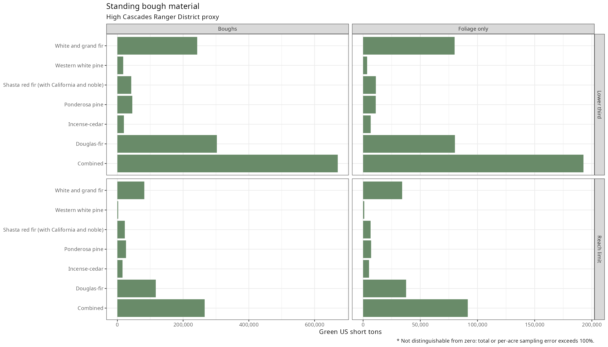
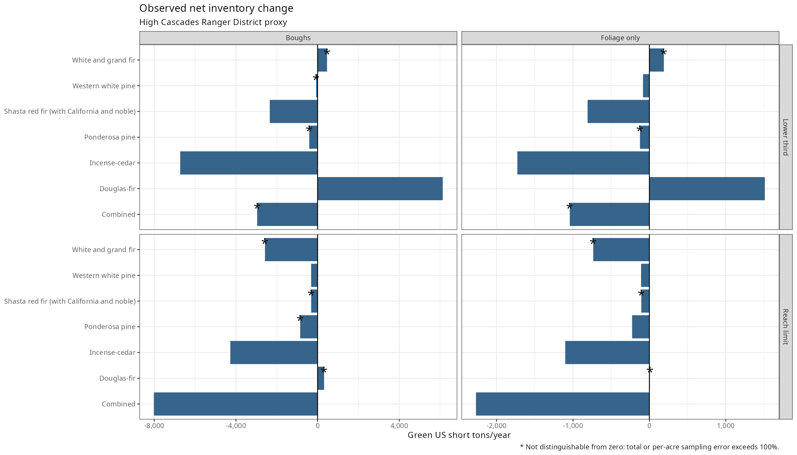

# Bough Resource Inventory

This analysis estimates standing bough material and annual inventory change on nonreserved forest land in the High Cascades Ranger District of the Rogue River-Siskiyou National Forest, approximated by the Cascades ecoregion subsections of the Rogue River portion because the district code is empty in this data vintage.

<!-- results:start -->

## Standing boughs

Standing totals and their intervals are green US short tons of foliage and branch wood cut to the bole in the lower-third height zone.

|Species                                    |Total  |Total error (%) |95% interval     | Plots|Per acre |Per-acre error (%) |Flag |
|:------------------------------------------|:------|:---------------|:----------------|-----:|:--------|:------------------|:----|
|Douglas-fir                                |302700 |13.6            |221639 to 383760 |   160|0.812    |12.5               |     |
|Incense-cedar                              |19793  |34.0            |6511 to 33075    |    64|0.053    |33.4               |     |
|Ponderosa pine                             |45403  |40.6            |9070 to 81736    |    50|0.122    |39.5               |     |
|Shasta red fir (with California and noble) |42144  |30.8            |16539 to 67748   |    52|0.113    |30.5               |     |
|Western white pine                         |17677  |45.9            |1669 to 33686    |    33|0.047    |46.0               |     |
|White and grand fir                        |242898 |15.0            |170969 to 314828 |   148|0.652    |13.1               |     |
|Combined                                   |670616 |11.2            |522821 to 818411 |   182|1.799    |9.2                |     |

Plots count distinct plots with eligible trees in each species group, including trees with zero modeled mass in the harvest zone.

## Annual change components

Annual totals are green US short tons per year in the same lower-third height zone.

|Species                                    |Component     |Total  |Total error (%) |Per acre |Per-acre error (%) |Flag                          |
|:------------------------------------------|:-------------|:------|:---------------|:--------|:------------------|:-----------------------------|
|Douglas-fir                                |Gross accrual |13191  |17.7            |0.035    |17.1               |                              |
|Douglas-fir                                |Survivor loss |-9743  |19.7            |-0.026   |18.7               |                              |
|Douglas-fir                                |Ingrowth      |4555   |22.0            |0.012    |21.3               |                              |
|Douglas-fir                                |Mortality     |948    |53.7            |0.003    |53.4               |                              |
|Douglas-fir                                |Removals      |925    |50.1            |0.002    |48.8               |                              |
|Douglas-fir                                |Net change    |6131   |55.8            |0.016    |55.9               |                              |
|Incense-cedar                              |Gross accrual |701    |31.7            |0.002    |31.3               |                              |
|Incense-cedar                              |Survivor loss |-2615  |70.7            |-0.007   |69.4               |                              |
|Incense-cedar                              |Ingrowth      |177    |54.3            |0.000    |53.2               |                              |
|Incense-cedar                              |Mortality     |68     |73.7            |0.000    |73.5               |                              |
|Incense-cedar                              |Removals      |4926   |91.9            |0.013    |90.6               |                              |
|Incense-cedar                              |Net change    |-6730  |93.6            |-0.018   |92.3               |                              |
|Ponderosa pine                             |Gross accrual |1287   |44.6            |0.003    |44.5               |                              |
|Ponderosa pine                             |Survivor loss |-2090  |43.3            |-0.006   |43.0               |                              |
|Ponderosa pine                             |Ingrowth      |394    |49.8            |0.001    |48.7               |                              |
|Ponderosa pine                             |Mortality     |0      |NA              |0.000    |NA                 |                              |
|Ponderosa pine                             |Removals      |0      |NA              |0.000    |NA                 |                              |
|Ponderosa pine                             |Net change    |-409   |246.7*          |-0.001   |246.8*             |not distinguishable from zero |
|Shasta red fir (with California and noble) |Gross accrual |1740   |32.7            |0.005    |32.4               |                              |
|Shasta red fir (with California and noble) |Survivor loss |-4335  |48.4            |-0.011   |48.1               |                              |
|Shasta red fir (with California and noble) |Ingrowth      |299    |46.8            |0.001    |46.6               |                              |
|Shasta red fir (with California and noble) |Mortality     |46     |73.9            |0.000    |73.8               |                              |
|Shasta red fir (with California and noble) |Removals      |0      |NA              |0.000    |NA                 |                              |
|Shasta red fir (with California and noble) |Net change    |-2343  |85.1            |-0.006   |84.9               |                              |
|Western white pine                         |Gross accrual |370    |61.7            |0.001    |61.7               |                              |
|Western white pine                         |Survivor loss |-485   |44.8            |-0.001   |44.6               |                              |
|Western white pine                         |Ingrowth      |216    |68.0            |0.001    |67.9               |                              |
|Western white pine                         |Mortality     |172    |85.0            |0.000    |84.9               |                              |
|Western white pine                         |Removals      |0      |NA              |0.000    |NA                 |                              |
|Western white pine                         |Net change    |-72    |350.4*          |-0.000   |350.3*             |not distinguishable from zero |
|White and grand fir                        |Gross accrual |12726  |17.3            |0.034    |16.2               |                              |
|White and grand fir                        |Survivor loss |-11181 |32.5            |-0.030   |30.6               |                              |
|White and grand fir                        |Ingrowth      |1379   |21.6            |0.004    |19.7               |                              |
|White and grand fir                        |Mortality     |1764   |35.8            |0.005    |35.4               |                              |
|White and grand fir                        |Removals      |697    |99.9            |0.002    |98.2               |                              |
|White and grand fir                        |Net change    |462    |846.2*          |0.001    |847.5*             |not distinguishable from zero |
|Combined                                   |Gross accrual |30015  |13.4            |0.080    |12.3               |                              |
|Combined                                   |Survivor loss |-30450 |20.3            |-0.081   |18.2               |                              |
|Combined                                   |Ingrowth      |7020   |17.3            |0.019    |16.0               |                              |
|Combined                                   |Mortality     |2998   |28.0            |0.008    |27.5               |                              |
|Combined                                   |Removals      |6548   |71.0            |0.017    |69.3               |                              |
|Combined                                   |Net change    |-2961  |319.6*          |-0.008   |318.1*             |not distinguishable from zero |

<!-- results:end -->

A row marked **not distinguishable from zero** has an unrounded total or per-acre sampling error above 100 percent; `NA` means the relative error is undefined.

Per-acre estimates use the nonreserved forest area for the corresponding sample.

Totals and interval endpoints are rounded to whole tons, per-acre estimates to three decimals, and sampling errors to one decimal.

The [standing CSV](output/standing.csv) and [change CSV](output/change.csv) retain full precision for boughs and foliage alone under the lower-third and 15-foot reach scenarios.

The [linear allocation sensitivity](output/linear_sensitivity.csv) holds the district sample and crown masses fixed.

## Run the analysis

Run these commands from the repository root with R and the packages dplyr, tidyr, ggplot2, scales, knitr, rFIA, and merchandiser installed.

Place a coherent public Oregon inventory release in `data/FIA`, or set `fia_dir` consistently in scripts 01 through 06.

| Command | Purpose |
| --- | --- |
| `Rscript scripts/01_stage_data.R` | Read the public inventory and record its file vintage. |
| `Rscript scripts/02_evaluations.R` | Record the selected inventory years and evaluations. |
| `Rscript scripts/03_bough_models.R` | Select the domain and estimate crown mass at both visits. |
| `Rscript scripts/04_estimates.R` | Estimate standing material, intervals and allocation sensitivity. |
| `Rscript scripts/05_regrowth.R` | Estimate annual change components on remeasured plots. |
| `Rscript scripts/06_sample_support.R` | Count sample support and check the estimated balances. |
| `Rscript scripts/07_tables.R` | Write the tables and figures from calculated outputs. |

The optional `scripts/00_download.R` contains the public download command for an empty local data directory.

Changes to domain or crown settings require another run of scripts 03 through 07.

Raw tables and tree records remain excluded from publication.

The [software versions](output/software_versions.csv) record the environment used for these results.

## Set the domain

All three domain settings are at the top of script 03.

| Selection | Settings |
| --- | --- |
| Ecoregion proxy | Use `forest_codes <- c(610)`, `ecoregion_subsections <- c('M242Bb', 'M242Be', 'M242Bg', 'M261Dh')`, and `district <- NA` for the High Cascades proxy. |
| Administrative forest | Set `ecoregion_subsections <- NULL` and `district <- NA` to run all of the selected `forest_codes`. |
| Recorded district | Set `district` to a verified `FVS_DISTRICT` code within `forest_codes` and `ecoregion_subsections <- NULL` when district assignments are populated. |

Forest selection uses `PLOTGEOM.FVS_LOC_CD`, and the proxy joins `PLOT.ECOSUBCD` onto `COND` before selecting nonreserved forest conditions.

The ecoregion proxy has boundary uncertainty because its codes are assigned from fuzzed and swapped public coordinates.

## Assumptions and sources

The [source ledger](data/sources.csv) records published values, citations and pages.

| Assumption | Application | Source |
| --- | --- | --- |
| Land | Nonreserved forest conditions on plots in forest code 610 and the four Cascades subsections. | Domain selection in script 03; ledger `reserved`. |
| Tree height | Live target trees taller than 15 feet. | Ledger `min_ht`. |
| Harvest zone | Lower third of total height, with an additional scenario limited to 15 feet above ground. | Ledger `zone_fraction`; reach assumption in script 03. |
| Crown shape | Cone with uniform biomass density and a continuous crown represented by compacted crown ratio. | Ledger `crown_ratio`; allocation assumption in script 03. |
| Removal cap | At most one third of foliage, with the same fraction applied to branch mass. | Ledger `removal_cap`; branch allocation assumption in script 03. |
| Material | Boughs include foliage and branch wood cut to the bole; foliage alone is secondary. | Mass definitions in script 03. |
| Density direction | Lower branches carry more wood per unit foliage than the crown average. | Qualitative assumption in NOTES. |
| Crown equations | National Scale Volume and Biomass equations use national coefficients and each tree's recorded species code. | Ledger `nsvb`; script 03. |
| Fir groups | Codes 20, 21 and 22 form Shasta red fir (with California and noble); codes 15 and 17 form white and grand fir because the related firs hybridize and field coding varies. | Reporting groups in script 03. |
| Green weight | Dry mass multiplied by 2.42 for all species and both components. | Ledger `green_moderate`; alternatives `green_dry` and `green_wet`. |
| Units | Green US short tons, with 2,000 pounds per ton and 0.45359237 kilograms per pound. | Exact unit definitions in script 03. |
| Population estimates | rFIA temporally indifferent estimator, most recent evaluation, common nonreserved-area denominator within each sample. | Scripts 03 through 05. |
| Survivor change | Difference between each tree's two modeled masses divided by its measurement interval. | Script 05. |
| Mortality and removals | Previous live mass multiplied by the annual inventory factor, omitting unobserved growth before loss. | Script 05. |
| Missing links | Trees without required previous measurements are excluded from affected components. | [Plot support](output/plot_counts.csv). |
| Sampling error | Inventory sampling variation excludes crown model, moisture, missing-link and proxy-boundary uncertainty. | Estimates in scripts 04 and 05. |

The January 2022 inventory copy reports through 2019 and does not measure current forest conditions.

These estimates describe modeled material and observed inventory change without establishing saleable yield, recovery after cutting or an annual cutting allowance.

[NOTES.md](NOTES.md) explains the data, crown geometry, sampling design, change components and limits of inference.
